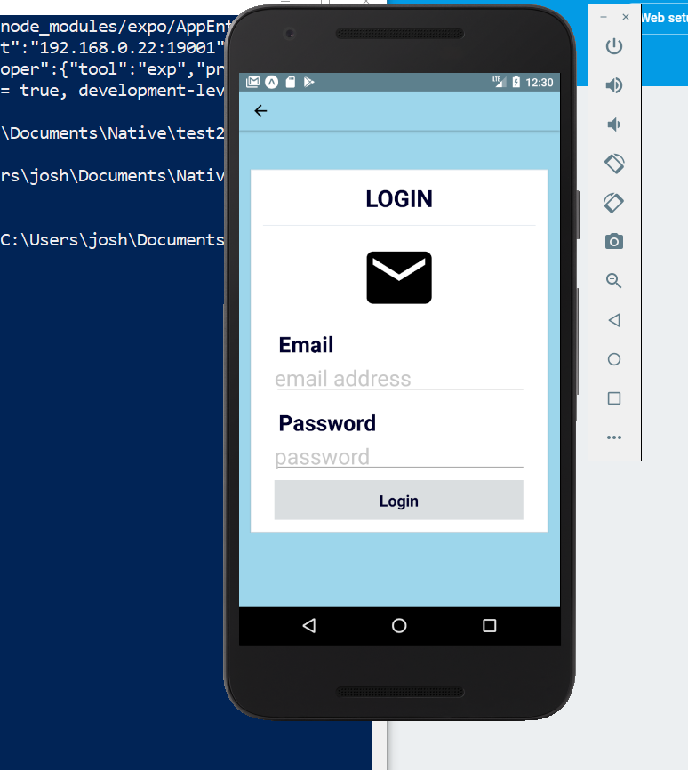

# Face off App

# The Project
This was a proof of concept for facial recognition, built with React Native, Kairos API, firebase and cloudinary

# HomePage

# Login page

# Login example

# Add user

# Things to fix and improvements

# How to run

You will have to setup up the face sets and keys for each api.

1: later
